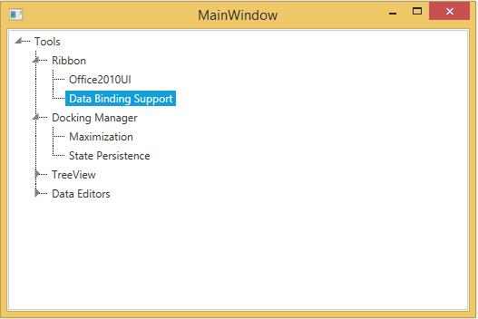

# Add WPF TreeView items by databinding in XML

This session describes about how to add [WPF TreeView](https://help.syncfusion.com/wpf/classic/treeview/overview) (TreeViewAdv) items by databinding in XML.

XML file can also be used as ItemsSource for the TreeViewAdv. The following example illustrates this:

1. Create the XML file with the following details and name it as Data.xml:

``` xml

<Products>
    <Product Name="Tools" >
        <Feature Name="Ribbon" >
            <Feature Name="Office2010UI"/>
            <Feature Name="Data Binding Support"/>
        </Feature>
        <Feature Name="Docking Manager">
            <Feature Name="Maximization"/>
            <Feature Name="State Persistence"/>
        </Feature>
        <Feature Name="TreeView">
            <Feature Name="Editing"/>
            <Feature Name="Sorting"/>
        </Feature>
        <Feature Name="Data Editors" >
            <Feature Name="Watermark Text" />
            <Feature Name="Extended Value Scrolling" />
        </Feature>
    </Product>
</Products>
```

2. Add the XmlDataProvider for the above XML document as follows:

``` xml
<Window.Resources>
    <XmlDataProvider Source="Data.xml" x:Key="xmlSource" XPath="Products"/>
</Window.Resources>
```

3. Set the `ItemsSource` property for the `TreeViewAdv` as follows:

``` xml
<syncfusion:TreeViewAdv ItemsSource="{Binding Source={StaticResource xmlSource}, XPath=Product}" >
    <syncfusion:TreeViewAdv.ItemTemplate>
        <HierarchicalDataTemplate ItemsSource="{Binding XPath=Feature}">
            <TextBlock Text="{Binding XPath=@Name}" />
        </HierarchicalDataTemplate>
    </syncfusion:TreeViewAdv.ItemTemplate>
</syncfusion:TreeViewAdv>
```

4. `TreeViewAdv` will be created as follows:

